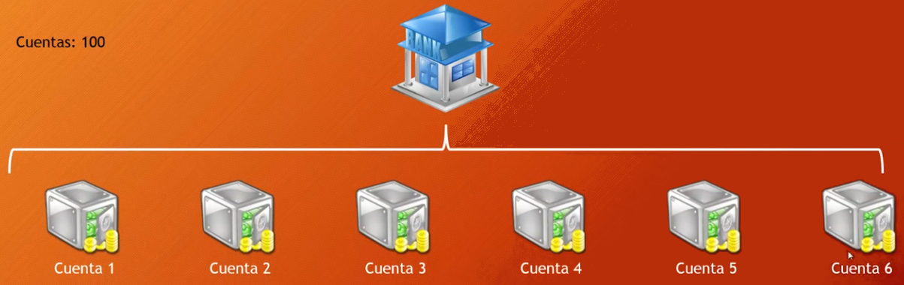

# Prueba  Sumativa  Nº 2

## **Patrones  de Software y Prog. - 14 de  Diciembre 2023**

  

## Antecedentes  Generales

  

**Duración  de  la  prueba**: 1.5 horas 

**Fecha  de  entrega  de  resultados** : 15 de Diciembre 2023
  

## Instrucciones: 

  

1. Esta  evaluación  tiene $3$ páginas (incluyendo  la  portada) y $9$ preguntas. Compruebe  que  dispone  de  todas  las  páginas. Responda a las  preguntas  en  los  espacios  previstos  para  ello  en  las  hojas  de preguntas. Asegúrese  de  marcar  apropiadamente  sus  respuestas.

2. Durante  la  prueba no se  puede  utilizar: teléfono  móvil, calculadora, apuntes u otras  fuentes  de  información. . Está  prohibido  intentar conectarse a internet  de  cualquier  manera. Si  es  sorprendido 
obtendrá  la  calificación  mínima. Tampoco  puede  utilizar  dispositivos de  almacenamiento  externos o cualquier  otro  dispositivo  relojes inteligentes.

3. Lea  la  prueba  completamente DOS veces  antes  de  hacer  cualquier pregunta. 

4. Una  prueba  respondida  correctamente  en  un $60\%$, de  acuerdo a las  ponderaciones  asignadas, corresponde a una  nota $4,0$. 

5. Solamente  se  pueden  realizar  preguntas  durante  los  primeros 10 minutos  de  la  prueba. Solo se  responderán  preguntas  respecto a los enunciados a viva  voz.

6. La  prueba  es individual, cualquier  sospecha  de  copia  será  calificada con  la  nota  mínima y el caso  será  remitido  al  comité  de  ética. 

7. En  su  espacio personal no debe  haber  nada  más  que  hojas  de  papel  en blanco, lápiz, goma y/o calculadora.

8. Los  estudiantes  quienes  se  les  compruebe  falta  de  honestidad académica o cualquier  otro  acto  contrario a las  normas  de permanencia  universitaria o al  espíritu  universitario, serán sancionados, según sea la  gravedad  de  la  falta, con  medidas  desde  la amonestación verbal hasta  la  suspensión o pérdida  de  la  condición  de estudiante, los  estudiantes  expulsados no podrán  volver a ingresar a ninguna  carrera, programa o curso  de  la  institución. El estudiante que  incurriere  en  falta  de  honestidad, durante  la  realización  de  un 
proceso  evaluativo, será  calificado  con  la  nota  mínima 1,0.

9. El resto  de  sus  implementos  debe  guardarlos  dentro  de  su mochila/bolso y ésta  debe  posicionarse  al  frente  debajo  de  la  pizarra. Si  leyó  hasta  este  punto, felicidades, para saber que  lo hizo  dibuje  una  estrella  al final de  esta  página. 
 
------------------------------------------------------------------------
## Enunciados/Problemas 

  

Usted ha sido  contratado  para  analizar  la  simulación  de  un  sistema bancario  que  prontamente  pasará a ser  implementado. Este  sistema  simula la  tarea  de  realizar  transferencias  automáticas  de $100$ cuentas corrientes  enumeradas  del $0$ al $99$ y cada  una  con  un  saldo  inicial  de U$2000 dólares. Por  lo  tanto el banco  simulado solo puede  gestionar U$200.000 dólares  en total.

Además, las  transferencias son realizadas  en  forma  aleatoria  tanto  para la  cuenta  de  origen, la  cuenta  de  destino y el monto a ser  transferido y cada  una  de  estas  transferencias  es  realizada  por  un  hilo  de  ejecución diferente. Por  ejemplo, supongamos  que el sistema  realiza  una transferencia  desde  la  cuenta $1$ a la  cuenta $4$ de U$500 dólares, esto  resultará  en  que  la  cuenta $1$ tendrá  un  saldo final de U$1500 dólares y la  cuenta $4$ un  saldo final de U$2500 dólares. La  Figura  a continuación muestra el esquema  de  simulación  del  sistema  bancario  para $6$ cuentas, donde  infinitas  transferencias son realizadas. 

 El sistema  de  simulación  está  construido  en  lenguaje  *Java*  como  un  proyecto  *Maven*  de  *Eclipse IDE*  diseñado  para  ser  ejecutado  en  modo consola. Está  compuesto  por $2$ paquetes: `cl.ucn.modelo`  que  contiene las  clases  de  modelo y `cl.ucn.principal`  que  contiene  una  clase principal. El primer paquete  contiene  las  dos  clases, `Banco.java` y `EjecucionTransferencias.java`  mientras  que el segundo  paquete solo contiene  la  clase  `Main.java`. Cada  vez  que  se  ejecute el programa, comenzarán  las  ejecuciones  de  las  transferencias sin parar  hasta  que usted  detenga  la  ejecución. Las  transacciones son registradas  en  un 
archivo  de  registro  ubicado  en  la  carpeta  `registros/transacciones.log`, donde  puede  observar  las  transferencias  realizadas (cuenta  de  origen, destino y cantidad), el monto total de  dinero  gestionado  por el banco y los  hilos  que  ejecutaron  la  transacción. Este  archivo  se  sobrescribe cada  vez  que  se  ejecuta  la  simulación.

  

## Preguntas 

  

1. Explique el problema  que  está  teniendo  la  simulación  al  ser ejecutado, de  acuerdo a lo  que  se  muestra  en el archivo `registros/transacciones.log`. Con solo $5$ segundos  de  ejecución  es suficiente  para  obtener  registros y notar el problema (**1 pt)**.

2. Implemente  la  solución  al  problema  detectado  explicando el mecanismo utilizado. Usted decide cual  mecanismo  será  utilizado y donde implementarlo  para resolver el problema, pero  debe  argumentar  la ventaja  del  mecanismo  escogido  por  sobre  los  otros  existentes (**3 pts**).

3. Existe  un  caso  de test llamado  `TestBanco`. Este  caso  de test al  ser ejecutado  falla. Explique  porqué  falla y como  solucionarlo (**1 pt**).

4. Implemente  un  caso  de test que  compruebe  una  transferencia  con  saldo insuficiente (**1 pt**).

5. Implemente  un  caso  de test que  compruebe  una  transferencia  exitosa (**1 pt**).

6. Implemente  un  caso  de test que  compruebe  una  transferencia a la misma  cuenta (**1 pt**).

7. Implemente  un  caso  de test que  compruebe  una  transferencia  con  un monto $0$ (**1 pt**).

8. Implemente  un  caso  de test que  compruebe  una  transferencia  con  monto máximo (**1 pt**).

9. Implemente  un  caso  de test que  compruebe  que el saldo total sea coherente  después  de  todas  las  transacciones. Para  este  caso  de teste  deberá  crear  una  lista  de  hilos, hacer  algunas  ejecuciones  de transferencias  usando  los  hilos, que  los  hilos  se  ejecuten  uno  tras otro y comprobar  si el saldo total es  coherente (**2 pts**).